# CPT_S 427 EA2: picoCTF Cybersecurity Challenges

## Overview
For this Extracurricular Assignment, I participated in picoCTF, an online cybersecurity Capture The Flag (CTF) platform. I successfully solved five distinct challenges across multiple domains of cybersecurity, including Cryptography, Forensics, Web Exploitation, and Binary Exploitation. This project demonstrates hands-on application of security concepts, vulnerability analysis, and standard software engineering practices.

## Deliverable Information
* **Tech Stack Used:** Python, Windows PowerShell, Web Developer Tools, Git.
* **Directory Structure:** 
  * All source code, scripts, and downloaded challenge files are organized by challenge inside the deliverable directory.
  * All screenshots and visual proof of completion are located in the evidence directory.

***

## Completed Challenges & Walkthroughs

### 1. Shared Secrets (Cryptography)
* **Location:** /deliverable/shared-secrets
* **Description:** A Diffie-Hellman key exchange challenge where the client secret was leaked in the provided message logs.
* **Solution:** I wrote a custom Python script (solve.py) to compute the shared key using the leaked client secret and the server's public parameters. I then used the calculated key to XOR decrypt the provided hexadecimal string and reveal the flag.
* **Proof of Participation:**

  **Challenge Briefing:** The initial challenge description and provided public parameters.
  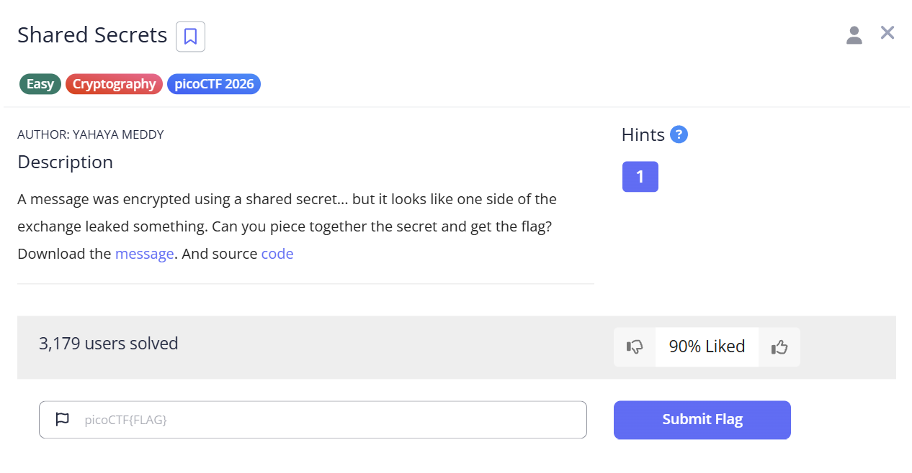

  **Decryption Execution:** Running the custom Python script to calculate the shared key and reveal the flag.
  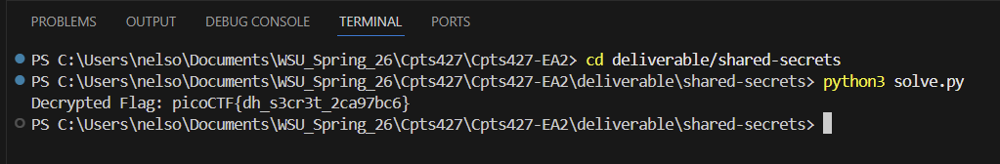

  **Challenge Completion:** Successful submission of the decrypted flag on the picoCTF platform.
  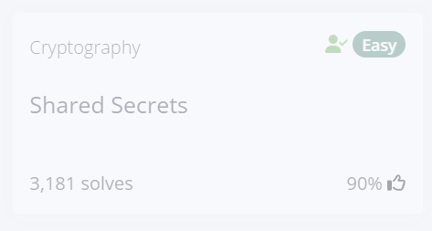

### 2. Flag in Flame (Forensics)
* **Location:** deliverable/flag-in-flame
* **Description:** An incident response scenario involving a suspicious, massive log file that was actually encoded data.
* **Solution:** I used the Windows certutil command to decode the Base64 text back into a hidden PNG image. Upon inspecting the image, I found a hex-encoded string at the bottom. I wrote a PowerShell command to decode the hex string into ASCII text to extract the final flag.
* **Proof of Participation:**

  **Challenge Briefing:** The prompt regarding the suspicious, oversized log file.
  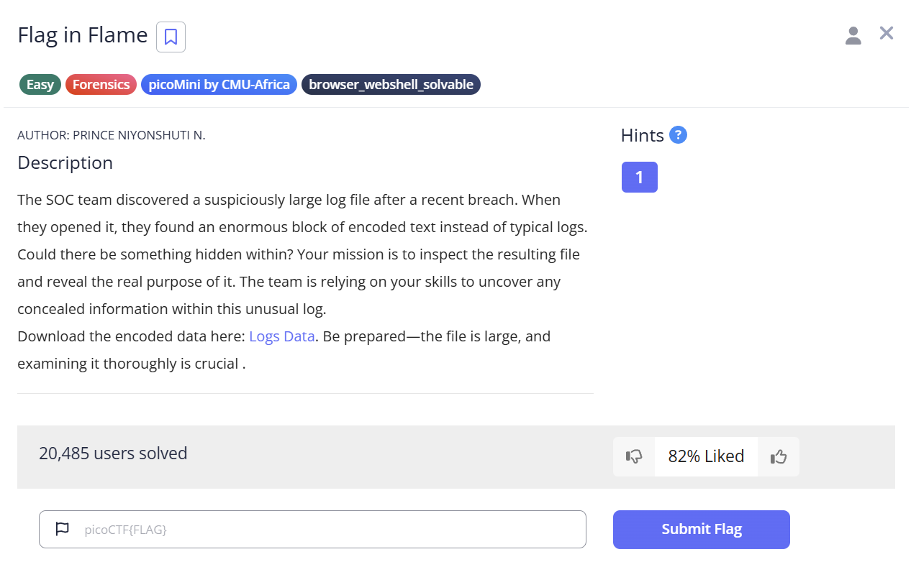

  **Base64 Decoding:** Using certutil to decode the fake log file into a hidden PNG image.
  

  **Artifact Discovery:** The decoded image revealing the hex-encoded string at the bottom.
  

  **Hexadecimal Decoding:** Running the PowerShell command to translate the hex string into the readable flag.
  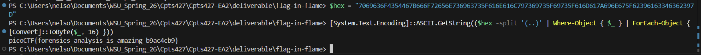

  **Challenge Completion:** Successful submission of the decoded flag on the picoCTF platform.
  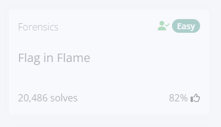

### 3. WebDecode (Web Exploitation)
* **Location:** deliverable/web-decode
* **Description:** A web vulnerability challenge requiring the use of browser inspection tools to find hidden data on an on-demand web instance.
* **Solution:** I used the browser's Developer Tools to inspect the DOM of the target website's "About" page. I located an anomalous Base64 encoded string hidden as an attribute within a section tag. I then used a PowerShell command to decode the Base64 string into the flag.
* **Proof of Participation:**

  **Challenge Briefing:** The challenge instructions regarding the web inspector.
  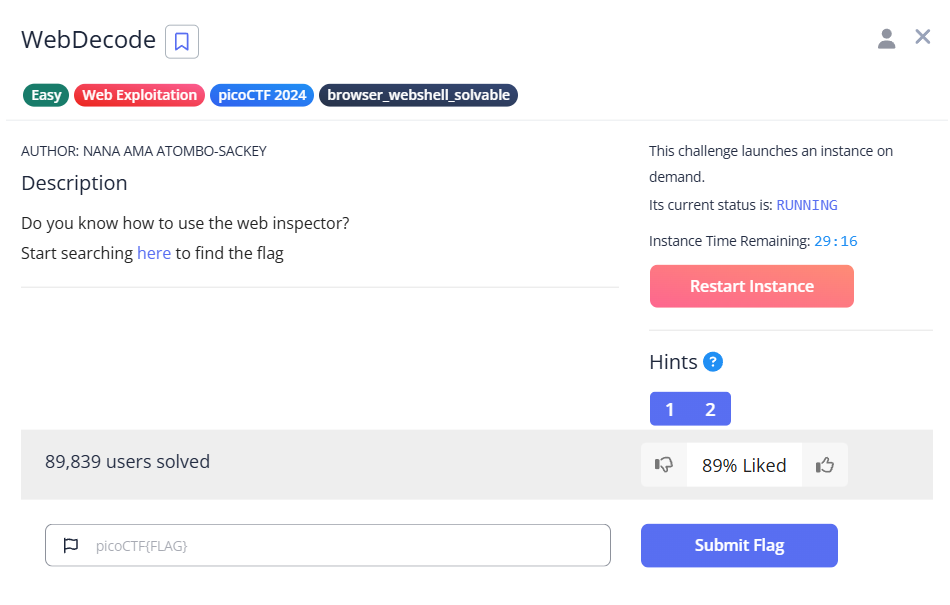

  **Target Instance:** The initial view of the provided on-demand challenge website.
  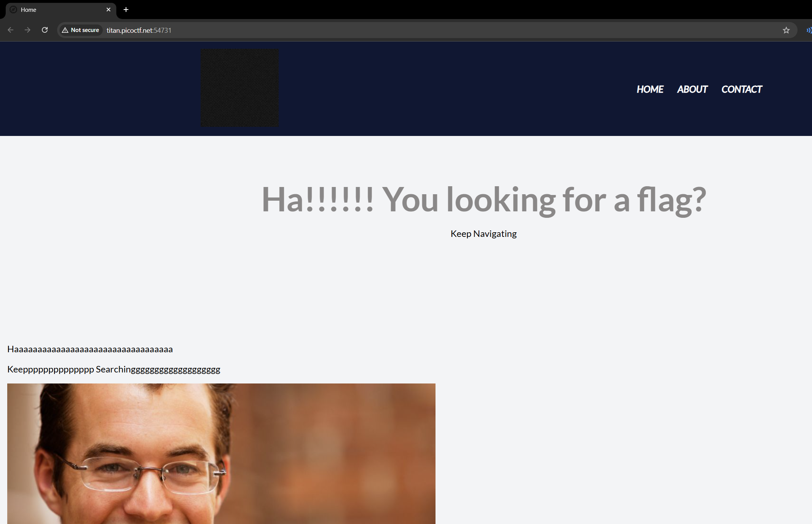

  **DOM Inspection:** Locating the hidden Base64 attribute using the browser Developer Tools.
  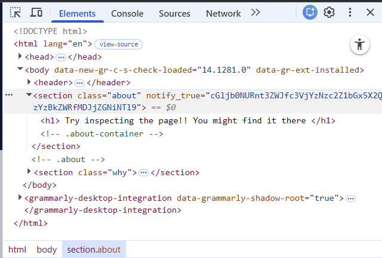

  **String Decoding:** Executing the PowerShell command to convert the Base64 string into the flag.
  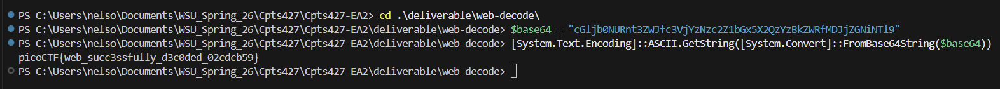

  **Challenge Completion:** Successful submission of the decoded flag on the picoCTF platform.
  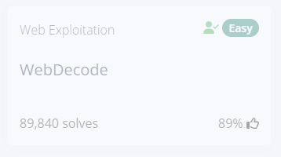

### 4. heap 0 (Binary Exploitation)
* **Location:** deliverable/heap-0
* **Description:** A memory corruption challenge demonstrating that buffer overflows are not just a stack concern, but can also occur on the heap.
* **Solution:** After analyzing the chall.c source code, I identified a vulnerability where a scanf function was taking input without bounds checking. Connecting to the live instance via nc, I intentionally overflowed the 32-byte input buffer by supplying 40 characters. This spilled into the adjacent heap memory block, overwriting the safe_var and triggering the program to print the flag.
* **Proof of Participation:**

  **Challenge Briefing:** The heap overflow challenge description and source code links.
  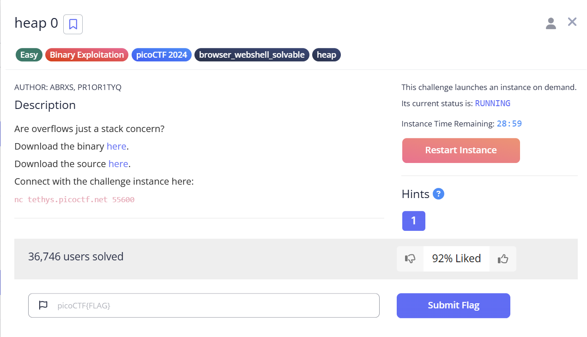

  **Buffer Overflow Execution:** Overwriting the safe variable to force the program to print the flag.
  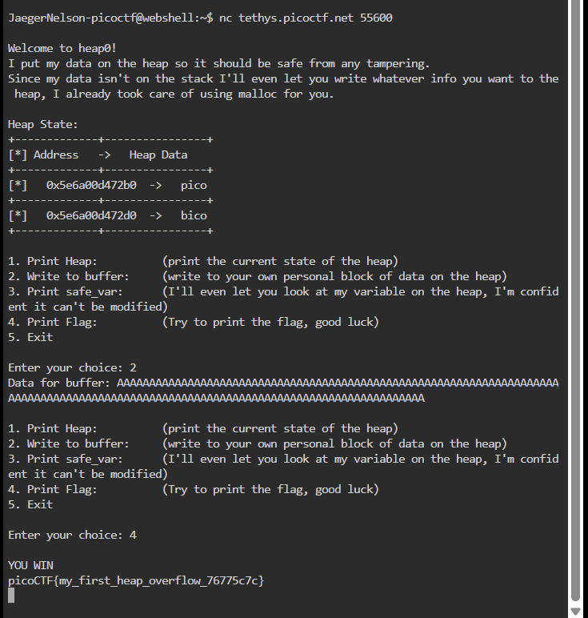

  **Challenge Completion:** Successful submission of the flag on the picoCTF platform.
  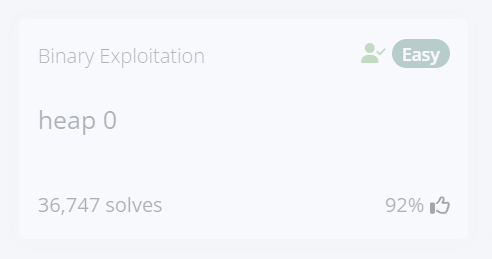

### 5. Local Authority (Web Exploitation)
* **Location:** deliverable/local-authority
* **Description:** A web authentication bypass challenge involving insecure, client-side credential verification.
* **Solution:** I inspected the source code of the failed login page and located a secure.js file being loaded by the browser. Opening this file revealed a hardcoded username and password in plain text. I used these exposed credentials to successfully log into the portal and retrieve the flag.
* **Proof of Participation:**

  **Challenge Briefing:** The web exploitation challenge description for the Local Authority instance.
  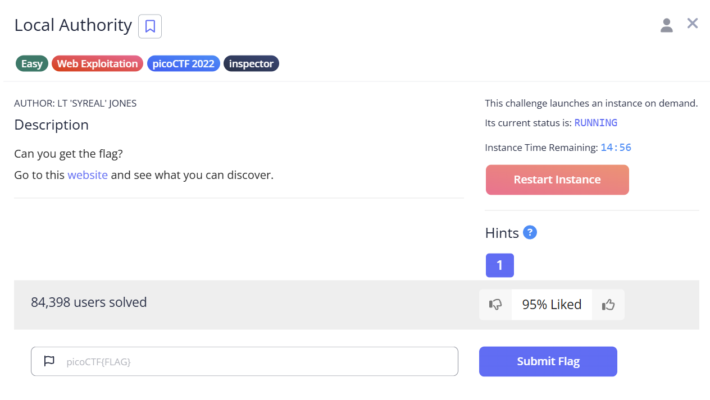

  **Target Instance:** The secure customer portal login page.
  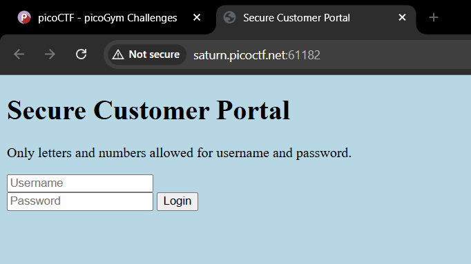

  **Failed Authentication:** The resulting page after attempting a generic dummy login.
  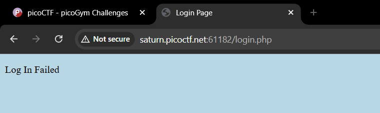

  **Source Code Inspection:** Discovering the hardcoded credentials inside the exposed secure.js file.
  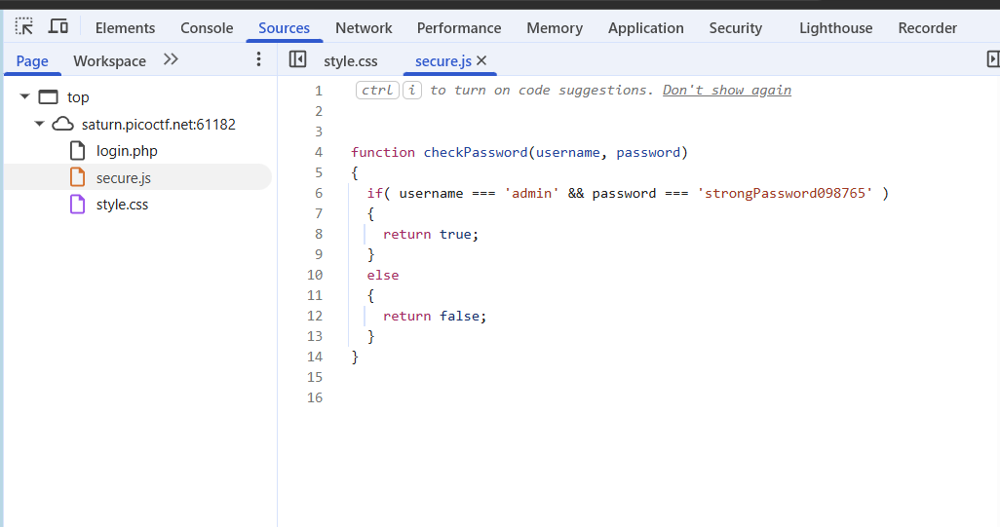

  **Authentication Bypass:** Using the discovered credentials to successfully log in and view the flag.
  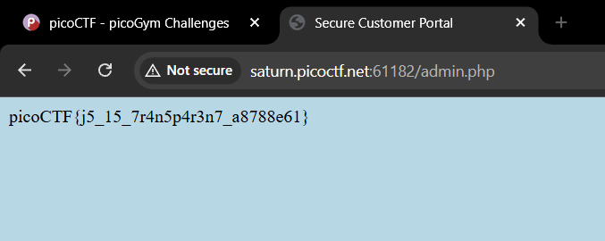

  **Challenge Completion:** Successful submission of the flag on the picoCTF platform.
  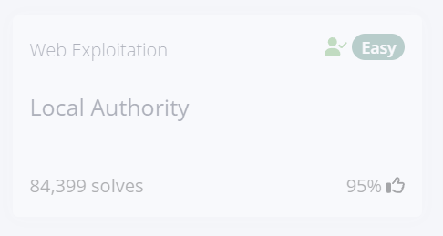

  ***

## Extracurricular Reflection

For a deeper look into the learning process, the technical decisions I made during these challenges, and my key takeaways from this activity, please read my full [EA2 Reflection Report](REFLECTION.md).